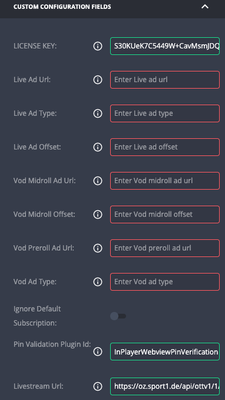

# Sport1 Player

*Built by Applicaster*

**Supports:** *iOS and Android*
*Current Version: 0.0.21 (Android), 1.6.1 (iOS)*

## About

a player plugin for sport1, wrapper around JWPlayerPlugin

### features and behaviour:

- display the login plugin when needed (if playable is not free or if the user login token is missing for live content)
- for live content - get stream url from a service using the user login token
- age validation screen (pin code) - presented by "webviewPin" plugin
  - for vod  - according "tracking_info" extension
  - for live
    - use the = "livestream url" service for getting the epg.
    - use the epg to decide about showing the validation plugin.
    - calculated for each program


## Configuration

The client should provide those following keys:
- LICENSE KEY - JW License Key
- Pin Validation Plugin Id - the id of the pin validation plugin
- Livestream Url - url for livestream epg - using in the age verification



## Project Setup (Android)

Setup your Plugin dev environment as described here: https://developer-zapp.applicaster.com/dev-env/android.html

Clone the project from github, cd to the Android folder, and open in Android Studio


# Deployment

1. Update version for desired module to deploy:
```
$MODULE/gradle.properties
$MODULE/plugin-manifest.json
```
2. Deploy manifest from the shell. Circle ci will deploy to bintray automatically.
```
zappifest publish --manifest $MODULE/plugin-manifest.json --access-token $YOUR_ZAPP_ACCESS_TOKEN